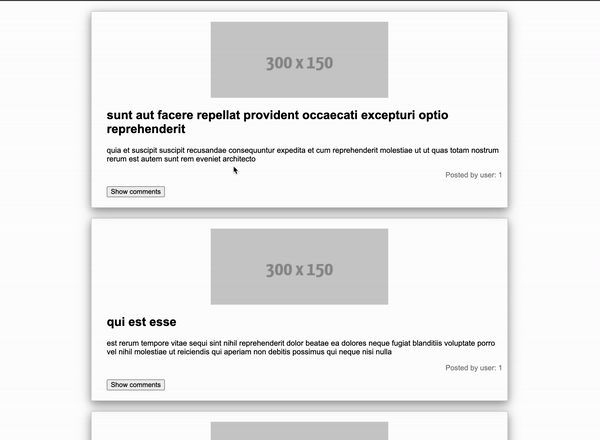

# Posts Feed Application

This project is a simple React application that retrieves and displays posts along with their comments from a JSON placeholder API.

### Features
- Retrieve posts from [JSONPlaceholder](https://jsonplaceholder.typicode.com/posts)
- Render each post with:
    - Image banner loaded from `https://fakeimg.pl/300x150`
    - Title
    - Body
    - User ID
- Allow users to load post comments
- Display comments retrieved from [JSONPlaceholder Comments](https://jsonplaceholder.typicode.com/posts/3/comments)

### Prerequisites
- Node.js
- npm (Node Package Manager)

### Installation
1. Clone the repository:
   ```bash
   git clone https://github.com/yourusername/posts-feed-app.git
   ```
2. Navigate to the project directory:
   ```bash
   cd posts-feed-app
   ```
3. Install the dependencies:
   ```bash
   npm install
   ```

### Running the Application
To start the development server:
```bash
npm start
```
The app will be available at [http://localhost:3000](http://localhost:3000).

### Running Tests
To run tests:
```bash
npm test
```

### Building the Application
To build the application for production:
```bash
npm run build
```
This will create an optimized production build in the `build` folder.

### Ejecting the Application
**Note: This is a one-way operation. Once you `eject`, you can’t go back!**
To eject the application configuration:
```bash
npm run eject
```

### Project Structure
- **src/**
    - **App.tsx**: Main component rendering the post feed.
    - **index.tsx**: Entry point of the React application.
    - **constants.ts**: Enum for post status and urls.
    - **types.ts**: TypeScript types for the application.
    - **styles.css**: Application styles.
- **public/**: Public assets for the application.
- **package.json**: Project configuration and dependencies.
- **tsconfig.json**: TypeScript configuration.
- **setupTests.ts**: Configuration for testing.
